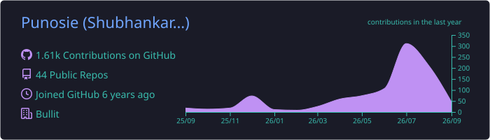
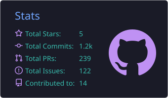
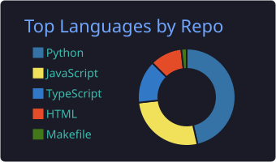
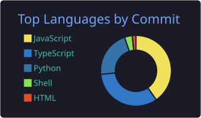
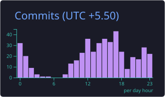

<!-- ============ HEADER BANNER ============ -->
<p align="center">
  
</p>

<!-- ============ VISITOR COUNTER ============ -->
<p align="center">
  
  <a href="https://www.linkedin.com/in/shubhankar-kaushik/"></a>
  <a href="https://punosie.vercel.app/"></a>
</p>

<!-- ============ TYPING INTRO ============ -->
<p align="center">
  <a href="https://github.com/Punosie">
    
  </a>
</p>

---

## 🧠 About Me

```python
class Shubhankar:
    role        = "Software Engineer @ Bullit Fintech"
    focus       = ["LLM Automation", "MCP Servers", "Agent Orchestration"]
    foundation  = ["Full-Stack", "Computer Vision", "Robotics"]
    education   = "B.Tech ECE, JIIT Noida (2025)"
    location    = "Bengaluru, India"
```

- 🤖 I build **automation pipelines and LLM-powered internal tools** that cut manual effort and improve operational efficiency.
- 🔌 Hands-on with **MCP servers** and **AI agent orchestration** backed by knowledge graphs for contextual codebase intelligence.
- ⚙️ Design **no-code/low-code workflows** in **n8n** to replace repetitive manual work.
- 🌐 Full-stack across **React · Node · Express · FastAPI · Django**, with **Firebase / MongoDB / SQL** on the data side.
- 👁️ Background in **Computer Vision & Robotics** — OpenCV, YOLOv8, and 6-DOF object tracking from my time in robotics labs.
- 🌱 Always shipping — check out my work at **[punosie.vercel.app](https://punosie.vercel.app/)**.

---

## 💼 Experience

<table>
  <tr>
    <td><b>🏦 Bullit Fintech</b></td>
    <td><i>SDE</i></td>
    <td align="right"><code>Aug 2025 – Present</code></td>
  </tr>
  <tr><td colspan="3">Deployed an <b>MCP server</b> exposing internal APIs to AI agents, an <b>agent orchestration pipeline</b> backed by a knowledge graph, and <b>5+ n8n workflows</b> — plus full-stack features for a loan platform used by 30+ connectors.</td></tr>
  <tr><td colspan="3"></td></tr>
  <tr>
    <td><b>🤖 Orangewood Labs</b></td>
    <td><i>SDE Intern</i></td>
    <td align="right"><code>May 2024 – Nov 2024</code></td>
  </tr>
  <tr><td colspan="3">Built computer-vision pipelines (Python · OpenCV · <b>YOLOv8</b>) for <b>6-DOF</b> robot object tracking; automated training workflows and containerized software with Docker.</td></tr>
  <tr><td colspan="3"></td></tr>
  <tr>
    <td><b>💻 Wizard Infoways</b></td>
    <td><i>Full-Stack Intern</i></td>
    <td align="right"><code>Jun 2023 – Jul 2023</code></td>
  </tr>
  <tr><td colspan="3">Built a custom <b>Django</b> API powering a feedback form on a React.js site, with responsive UI and smooth end-to-end data flow.</td></tr>
</table>

<p align="center">
  
  
  
  
</p>

---

## 🛠️ Tech Stack

**🤖 AI · Automation · CV**


**🎨 Frontend**


**⚙️ Backend · Data**


**🧰 Tooling**


---

## 🚀 Featured Projects

<table>
  <tr>
    <td width="50%" valign="top">
      <h3 align="center"><a href="https://github.com/Punosie/TradeSim">📈 TradeSim</a></h3>
      <p align="center">
        
        
        
        
        
      </p>
      <p>Crypto trading simulator — <b>FastAPI</b> backend for real-time order matching &amp; trade metrics, a <b>scikit-learn</b> model predicting mid-prices, and <b>MongoDB</b> for historical insights.</p>
      <p align="center"><a href="https://github.com/Punosie/TradeSim"></a></p>
    </td>
    <td width="50%" valign="top">
      <h3 align="center"><a href="https://github.com/Punosie/D2C-AI-Employee">🤝 D2C-AI-Employee</a></h3>
      <p align="center">
        
        
        
        
        
      </p>
      <p>An <b>LLM-powered agent</b> for D2C brands — connects Shopify, Meta Ads and Sheets into one data model and answers questions in natural language, with every number cited back to its source row.</p>
      <p align="center"><a href="https://github.com/Punosie/D2C-AI-Employee"></a> <a href="https://d2c-ai-employee-ui.vercel.app/"></a></p>
    </td>
  </tr>
  <tr>
    <td width="50%" valign="top">
      <h3 align="center"><a href="https://github.com/Punosie/facebook-graph-mcp">🔌 facebook-graph-mcp</a></h3>
      <p align="center">
        
        
        
        
      </p>
      <p>An <b>MCP server</b> wrapping the Facebook Graph API (v25.0), built with <b>FastMCP</b> — giving AI agents structured, typed access to social data.</p>
      <p align="center"><a href="https://github.com/Punosie/facebook-graph-mcp"></a></p>
    </td>
    <td width="50%" valign="top">
      <h3 align="center"><a href="https://github.com/Punosie/Autonomous-Vehicle">🚗 Autonomous-Vehicle</a></h3>
      <p align="center">
        
        
        
        
      </p>
      <p>Final-year <b>computer vision + robotics</b> project — on-device <b>YOLOv8</b> detection over a live camera feed, exploring perception and control for autonomous driving.</p>
      <p align="center"><a href="https://github.com/Punosie/Autonomous-Vehicle"></a></p>
    </td>
  </tr>
  <tr>
    <td width="50%" valign="top">
      <h3 align="center"><a href="https://github.com/Punosie/DhanMantri">💰 DhanMantri</a></h3>
      <p align="center">
        
        
        
        
      </p>
      <p>A <b>fintech</b> dashboard for smarter money management — real-time market performance, OHLC price visualisations and global market news in one view.</p>
      <p align="center"><a href="https://github.com/Punosie/DhanMantri"></a></p>
    </td>
    <td width="50%" valign="top">
      <h3 align="center"><a href="https://github.com/Punosie/Streamify">🎵 Streamify</a></h3>
      <p align="center">
        
        
        
        
      </p>
      <p>A <b>music streaming analytics dashboard</b> — users, streams, revenue and top-artist metrics turned into responsive, visual insight.</p>
      <p align="center"><a href="https://github.com/Punosie/Streamify"></a></p>
    </td>
  </tr>
</table>

---

## 📊 GitHub Stats

<!-- Cards below are generated by .github/workflows/profile-summary-cards.yml and
     committed into this repo, so they never depend on a third-party instance. -->

<p align="center">
  
</p>

<p align="center">
  
  
</p>

<p align="center">
  
  
</p>

<p align="center">
  
</p>

<!-- ============ ACTIVITY GRAPH ============ -->
<p align="center">
  
</p>

<!-- ============ CONTRIBUTION SNAKE ============ -->
<p align="center">
  <picture>
    <source media="(prefers-color-scheme: dark)" srcset="https://raw.githubusercontent.com/Punosie/Punosie/output/github-contribution-grid-snake-dark.svg" />
    <source media="(prefers-color-scheme: light)" srcset="https://raw.githubusercontent.com/Punosie/Punosie/output/github-contribution-grid-snake.svg" />
    
  </picture>
</p>

---

## 📬 Connect With Me

<p align="center">
  <a href="mailto:shubhankar.kaushik2003@gmail.com"></a>
  &nbsp;
  <a href="https://www.linkedin.com/in/shubhankar-kaushik/"></a>
  &nbsp;
  <a href="https://www.instagram.com/pun0sie/"></a>
</p>

<p align="center">
  <a href="https://www.linkedin.com/in/shubhankar-kaushik/"></a>
  <a href="https://punosie.vercel.app/"></a>
  <a href="https://www.behance.net/"></a>
  <a href="mailto:shubhankar.kaushik2003@gmail.com"></a>
</p>

---

<h3 align="center">💬 Let's Collaborate</h3>

<p align="center">When I'm off the clock: 🏸 badminton · 🌸 anime · 🎮 gaming. I love building creative, challenging, and fun projects — reach out!</p>

<p align="center">
  
</p>

<p align="center">
  
</p>
